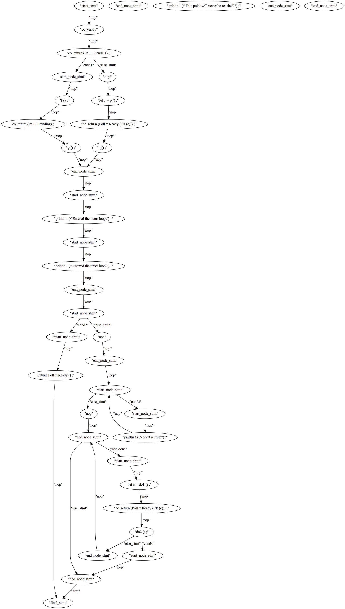

# generator
This crate provides a proof-of-concept proc macro attribute that allows transforming generators to state machines.

## example
The following code is not a valid rust function but showing the logic of generating code.
````rust
pub fn poll_read_decrypted<R>(
    &mut self,
    ctx: &mut Context<'_>,
    r: &mut R,
    dst: &mut [u8],
    ) -> Poll<io::Result<(usize)>>
    where
    R: AsyncRead + Unpin,
    {
        if cond1{
            f();
            yield return Poll::Pending;
            g();
        }else{
            let c=p();
            yield return Poll::Ready(Ok(c));
            q();
        }
        'outer: loop {
            println!("Entered the outer loop");

            'inner: loop {
                println!("Entered the inner loop");

                // This would break only the inner loop
                //break;

                // This breaks the outer loop
                break 'outer;
            }

            println!("This point will never be reached");
        }
        loop{
            if cond2{
                continue;
            } else{
                break;
            }
        }
        loop{
            if cond3{
                println!("cond3 is true");
                continue;
            } else{
                break;
            }
        }
        while not_done{
            let c=do1();
            yield return Poll::Ready(Ok(c));
            do2();
            if cond4{
                break;
            }
        }
    }
````

The CFG (control flow graph) of above code is

