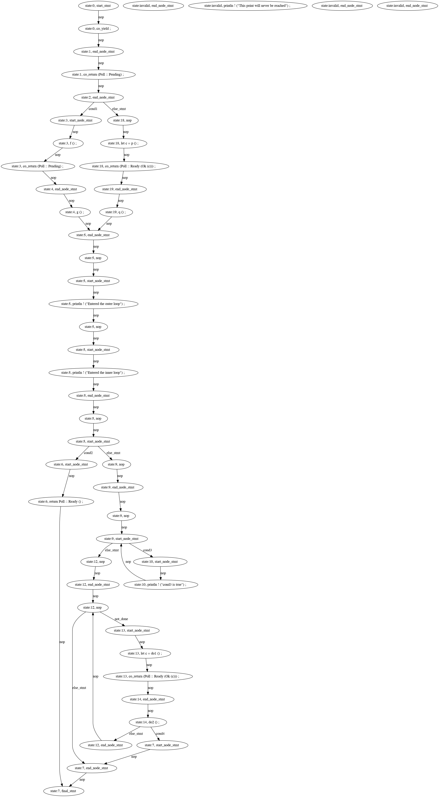

# generator (WIP)
This crate provides a proof-of-concept proc macro attribute that allows transforming generators to state machines.

## example
The following code is not a valid rust function but showing the logic of generating code.
````rust
pub fn poll_read_decrypted<R>(
    &mut self,
    ctx: &mut Context<'_>,
    r: &mut R,
    dst: &mut [u8],
    ) -> Poll<io::Result<(usize)>>
    where
    R: AsyncRead + Unpin,
    {
        if cond1{
            f();
            yield return Poll::Pending;
            g();
        }else{
            let c=p();
            yield return Poll::Ready(Ok(c));
            q();
        }
        'outer: loop {
            println!("Entered the outer loop");

            'inner: loop {
                println!("Entered the inner loop");

                // This would break only the inner loop
                //break;

                // This breaks the outer loop
                break 'outer;
            }

            println!("This point will never be reached");
        }
        loop{
            if cond2{
                continue;
            } else{
                break;
            }
        }
        loop{
            if cond3{
                println!("cond3 is true");
                continue;
            } else{
                break;
            }
        }
        while not_done{
            let c=do1();
            yield return Poll::Ready(Ok(c));
            do2();
            if cond4{
                break;
            }
        }
    }
````

The above code would be expanded as: 
````rust
pub fn poll_read_decrypted<R>(
    &mut self,
    ctx: &mut Context<'_>,
    r: &mut R,
    dst: &mut [u8],
) -> Poll<io::Result<(usize)>>
where
    R: AsyncRead + Unpin,
{
    'genloop: loop {
        match state {
            _ => {
                break 'genloop;
            }
            0 => {
                state = 16;
                if cond1 {
                    state = 1;
                    continue 'genloop;
                }
            }
            1 => {
                f();
                state = 2;
                return Poll::Pending;
            }
            2 => {
                g();
                state = 3;
            }
            3 => {
                println!("Entered the outer loop");
                println!("Entered the inner loop");
                state = 4;
            }
            4 => {
                state = 6;
                if cond2 {
                    state = 5;
                    continue 'genloop;
                }
            }
            5 => {
                state = 4;
            }
            6 => {
                state = 7;
            }
            7 => {
                state = 9;
                if cond3 {
                    state = 8;
                    continue 'genloop;
                }
            }
            8 => {
                println!("cond3 is true");
                state = 7;
            }
            9 => {
                state = 10;
            }
            10 => {
                state = 14;
                if not_done {
                    state = 11;
                    continue 'genloop;
                }
            }
            11 => {
                let c = do1();
                state = 12;
                return Poll::Ready(Ok(c));
            }
            12 => {
                do2();
                state = 15;
                if cond4 {
                    state = 13;
                    continue 'genloop;
                }
            }
            13 => {
                state = 14;
            }
            14 => {
                state = 37;
            }
            15 => {
                state = 10;
            }
            16 => {
                let c = p();
                state = 17;
                return Poll::Ready(Ok(c));
            }
            17 => {
                q();
                state = 3;
            }
        }
    }
}

````

The CFG (control flow graph) of above code is


